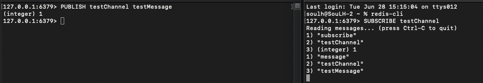

# RabbitMQ-Begin 

### Starting (M1-ARM64)

```
Install Redis

brew install redis

```

```
Start

redis-server


```


```
Redis CLI

redis-cli

```


```
Sending message

publish testChannel TestMessage

```

```
Reading message

subscribe testChannel
```


<p>
    

</p>


####    Thank You Kablosuzkedi